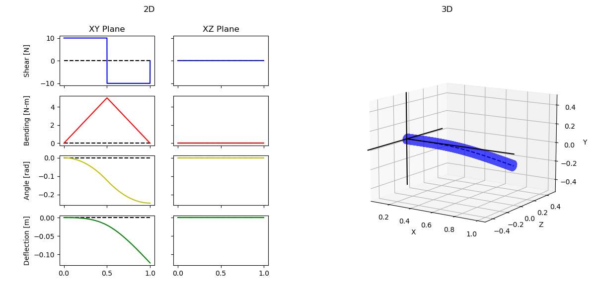
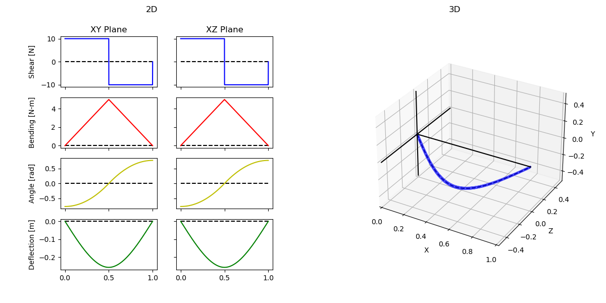

# DEMOS

- [DEMOS](#demos)
  - [Simple Cantilever Beam](#simple-cantilever-beam)
    - [Cantilever Graphs](#cantilever-graphs)
    - [Cantilever Analysis Console Output](#cantilever-analysis-console-output)
    - [Cantilever Input Parameters and Loads](#cantilever-input-parameters-and-loads)
  - [Fixed-Support Beam](#fixed-support-beam)
    - [Fixed-Support Graphs](#fixed-support-graphs)
    - [Fixed-Support Analysis Console Output](#fixed-support-analysis-console-output)
    - [Fixed-Support Input Parameters and Loads](#fixed-support-input-parameters-and-loads)

## Simple Cantilever Beam

### Cantilever Graphs



### Cantilever Analysis Console Output

``` txt
[BEAM ANALYSIS] - Running analysis with beam parameters:
[BEAM ANALYSIS] - length:                        1.0
[BEAM ANALYSIS] - Young's modulus of material:   2070000
[BEAM ANALYSIS] - Moment of inertia:             4.9087385212340526e-06
# =============================================================================== #
[BEAM ANALYSIS] - [SOLVING] - Solved for xy angle constant C1 = 0.0
[BEAM ANALYSIS] - [SOLVING] - Solved for xy deflection constant C2 = 0.0
# =============================================================================== #
[BEAM ANALYSIS] - Singularity functions in XY:
10.0 - 20.0<x - 0.5>^0 + 10.0<x - 1.0>^0
10.0<x - 0>^1 - 20.0<x - 0.5>^1 + 10.0<x - 1.0>^1
(10.0 / 2)<x - 0>^2 - (20.0 / 2)<x - 0.5>^2 + (10.0 / 2)<x - 1.0>^2 + 0.0
(10.0 / 6)<x - 0>^3 - (20.0 / 6)<x - 0.5>^3 + (10.0 / 6)<x - 1.0>^3 + 0.0 + 0.0
# =============================================================================== #
[BEAM ANALYSIS] - Report in XY:
Max Shear:                 10.0 [N]
Max Moment:               4.995 [N-m]
Max Angle:              0.24604 [rad]
Max Deflection:         0.12302 [m]
# =============================================================================== #
```

### Cantilever Input Parameters and Loads

```python
# =================================== #
#    1. Define Beam Parameters        #
# =================================== #
# E - Youngs Modulus                  #
# I - Moment of Inertia I             #
# L - Beam Length                     #
# =================================== #
E = 207 * 10**4
L = 1.0
CS = CrossSection(CrossSectionTypes.CIRC, [.05])
B = Beam(L, E, crossSection=CS)


# =================================== #
#    2. Add Loads                     #
# =================================== #
# Use theta = 0 to indicate XY plane  #
# Use theta = 90 to indicate XZ plane #
#                                     #
#           | (90 - XZ plane)         #
#        \  |                         #
#         \ |                         #
#          \|________ (0 - XY plane)  #
# =================================== #
B.addPointLoad(0, 10, 0)

B.addPointLoad(L/2, -20, 0)

B.addPointLoad(L, 10, 0)

# =================================== #
#    3. Input Boundary Conditions     #
# =================================== #
# Use the loading angle convention    #
# =================================== #
# B.addBoundaryCondition(L/2, BoundaryConditionTypes.ANGLE, 0)
B.addBoundaryCondition(0, BoundaryConditionTypes.DEFLECTION, 0)
B.addBoundaryCondition(0, BoundaryConditionTypes.ANGLE, 0.0)


# =================================== #
#    4. Run Analysis                  #
# =================================== #
B.runAnalysis()
```

## Fixed-Support Beam

### Fixed-Support Graphs



### Fixed-Support Analysis Console Output

``` txt
[BEAM ANALYSIS] - Running analysis with beam parameters:
[BEAM ANALYSIS] - length:                        1.0      
[BEAM ANALYSIS] - Young's modulus of material:   207000000
[BEAM ANALYSIS] - Moment of inertia:             7.853981633974483e-09
# ================================================================================ #
[BEAM ANALYSIS] - [SOLVING] - Solved for xy angle constant C1 = -1.25
[BEAM ANALYSIS] - [SOLVING] - Solved for xy deflection constant C2 = 0.0
# ================================================================================ #
[BEAM ANALYSIS] - [SOLVING] - Solved for xz angle constant C1 = -1.25
[BEAM ANALYSIS] - [SOLVING] - Solved for xz deflection constant C2 = 0.0
# ================================================================================ #
[BEAM ANALYSIS] - Singularity functions in XY:
10.0 - 20.0<x - 0.5>^0 + 10.0<x - 1.0>^0
10.0<x - 0>^1 - 20.0<x - 0.5>^1 + 10.0<x - 1.0>^1
(10.0 / 2)<x - 0>^2 - (20.0 / 2)<x - 0.5>^2 + (10.0 / 2)<x - 1.0>^2 - 1.25
(10.0 / 6)<x - 0>^3 - (20.0 / 6)<x - 0.5>^3 + (10.0 / 6)<x - 1.0>^3 - 1.25 + 0.0
# ================================================================================ #
[BEAM ANALYSIS] - Singularity functions in XZ:
10.0 - 20.0<x - 0.5>^0 + 10.0<x - 1.0>^0
10.0<x - 0>^1 - 20.0<x - 0.5>^1 + 10.0<x - 1.0>^1
(10.0 / 2)<x - 0>^2 - (20.0 / 2)<x - 0.5>^2 + (10.0 / 2)<x - 1.0>^2 - 1.25
(10.0 / 6)<x - 0>^3 - (20.0 / 6)<x - 0.5>^3 + (10.0 / 6)<x - 1.0>^3 - 1.25 + 0.0
# ================================================================================ #
[BEAM ANALYSIS] - Report in XY:
Max Shear:                 10.0 [N]
Max Moment:               4.995 [N-m]
Max Angle:              0.76886 [rad]
Max Deflection:         0.25629 [m]
# ================================================================================ #
[BEAM ANALYSIS] - Report in XZ:
Max Shear:                 10.0 [N]
Max Moment:               4.995 [N-m]
Max Angle:              0.76886 [rad]
Max Deflection:         0.25629 [m]
# ================================================================================ #
```

### Fixed-Support Input Parameters and Loads

```python
# =================================== #
#    1. Define Beam Parameters        #
# =================================== #
# E - Youngs Modulus                  #
# I - Moment of Inertia I             #
# L - Beam Length                     #
# =================================== #
E = 207 * 10**6
L = 1.0
CS = CrossSection(CrossSectionTypes.CIRC, [.01])
B = Beam(L, E, crossSection=CS)


# =================================== #
#    2. Add Loads                     #
# =================================== #
# Use theta = 0 to indicate XY plane  #
# Use theta = 90 to indicate XZ plane #
#                                     #
#           | (90 - XZ plane)         #
#        \  |                         #
#         \ |                         #
#          \|________ (0 - XY plane)  #
# =================================== #
B.addPointLoad(0, 10, 0)
B.addPointLoad(0, 10, 90)

B.addPointLoad(L/2, -20, 0)
B.addPointLoad(L/2, -20, 90)

B.addPointLoad(L, 10, 0)
B.addPointLoad(L, 10, 90)

# =================================== #
#    3. Input Boundary Conditions     #
# =================================== #
# Use the loading angle convention    #
# =================================== #
# B.addBoundaryCondition(L/2, BoundaryConditionTypes.ANGLE, 0)
B.addBoundaryCondition(0, BoundaryConditionTypes.DEFLECTION, 0)
B.addBoundaryCondition(L, BoundaryConditionTypes.DEFLECTION, 0.0)


# =================================== #
#    4. Run Analysis                  #
# =================================== #
B.runAnalysis()
```
